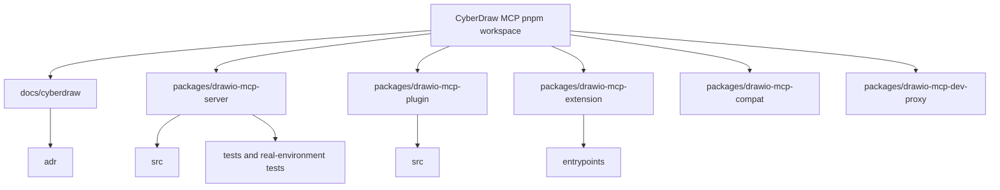
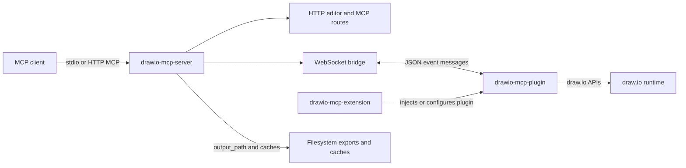
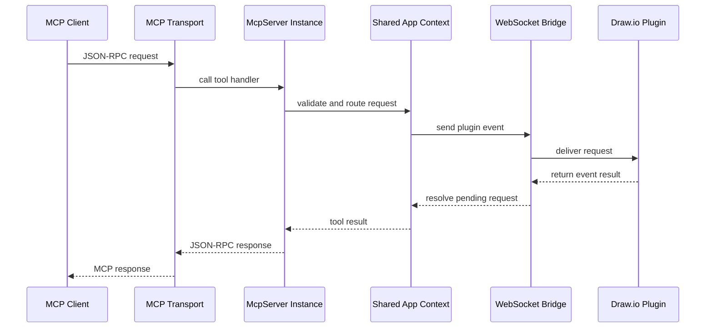
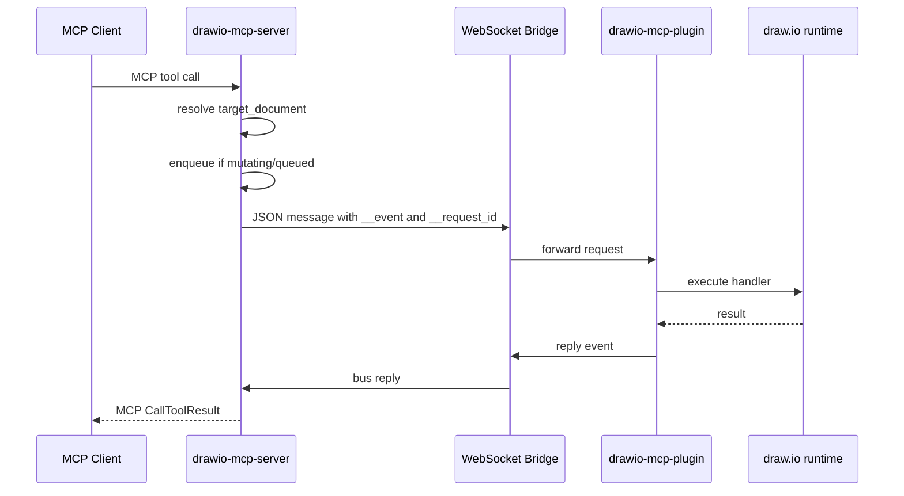
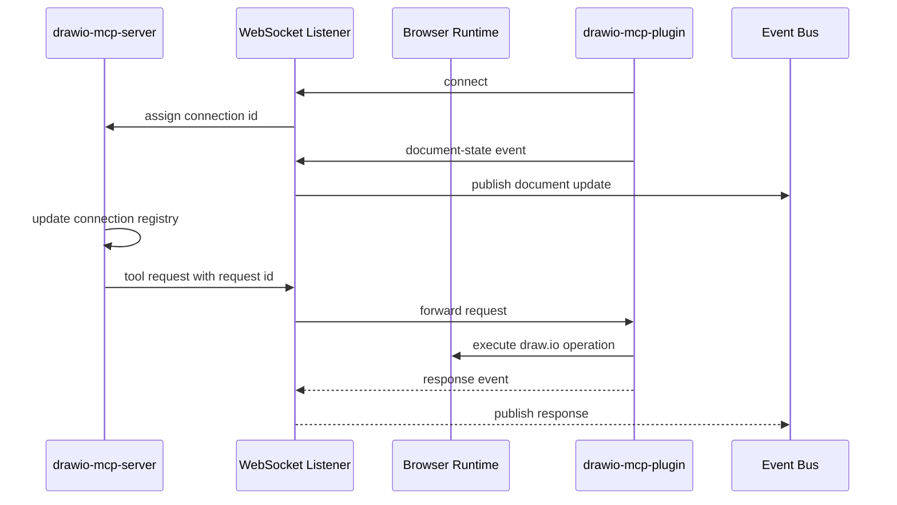
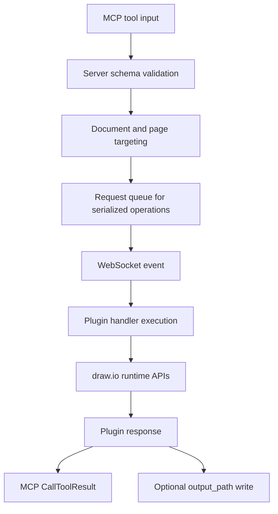
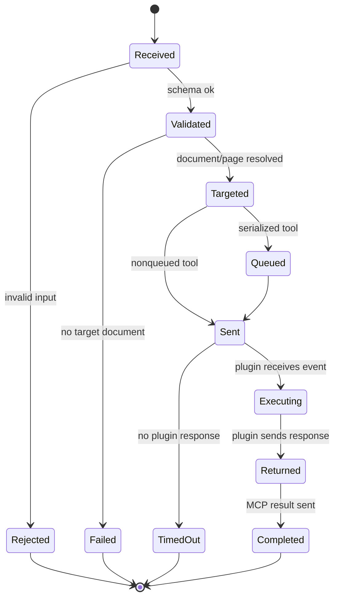

# CyberDraw MCP Architecture Baseline

This document describes the inherited Draw.io MCP architecture as observed
during M0. It does not propose architectural changes.

## Monorepo

The repository is a pnpm workspace with packages under `packages/*`.

## Packages

| Package | Role |
| --- | --- |
| `drawio-mcp-server` | Node MCP server, stdio and HTTP transports, WebSocket bridge, built-in editor routes, TLS, assets, tool schemas |
| `drawio-mcp-plugin` | Browser runtime loaded inside draw.io; executes tool handlers against draw.io APIs |
| `drawio-mcp-extension` | WXT browser extension that injects/bridges the plugin into draw.io pages and exposes popup/options UI |
| `drawio-mcp-compat` | Shared semver/range helpers for draw.io version compatibility |
| `drawio-mcp-dev-proxy` | Local Caddy-based HTTPS reverse proxy for WSS/TLS development |

## General Architecture

## Server

Entry point: `packages/drawio-mcp-server/src/index.ts`.

The server creates a `DrawioMcpApp` containing:

- an `EventEmitter` bus;
- MCP server factory;
- WebSocket connection registry;
- document routing state;
- request queue;
- logger;
- TLS material;
- stdio and HTTP startup functions.

Each MCP transport receives its own `McpServer` instance because the MCP SDK
allows one transport per protocol instance. These server instances share the app
context and the WebSocket/document state.

## MCP Transports

Supported transports:

- `stdio`: default MCP transport for local clients.
- `http`: streamable HTTP MCP endpoint at `/mcp`.
- `stdio,http`: both transports.

The built-in editor enables HTTP features automatically.

## MCP Flow

## HTTP Surface

When enabled, Hono serves:

| Route | Purpose |
| --- | --- |
| `/health` | Health JSON |
| `/api/config` | Editor/plugin config, including WebSocket port or URL |
| `/js/mcp-plugin.js` | Bundled plugin script |
| `/` and static paths | Built-in draw.io editor assets |
| `/mcp` | Streamable HTTP MCP endpoint |

## WebSocket Bridge

The server always starts a WebSocket listener for plugin/extension connections.
Default port is `3333`; TLS can switch it to WSS.

## WebSocket Flow

## Data Flow

MCP clients call tools through stdio or streamable HTTP. The server validates the
tool input with the registered schema, resolves document/page targeting and, for
live draw.io operations, forwards an event over the WebSocket bridge to a
connected plugin instance.

The browser plugin executes the operation inside the draw.io runtime and returns
the result to the server through the same WebSocket connection. The server maps
the response back to the pending MCP call and returns an MCP `CallToolResult`.

Read-only metadata such as connected documents is held in memory by the server.
Most diagram mutations happen inside the draw.io browser runtime. Exported
diagram content may also flow to the filesystem when a trusted client supplies
an absolute `output_path`.

## Component Responsibilities

| Component | Responsibilities | Not responsible for |
| --- | --- | --- |
| MCP server | Transport startup, tool registration, schema validation, document routing, request queueing, logging, editor routes, TLS and optional export writes | Authenticating remote clients, interpreting draw.io internals directly |
| WebSocket bridge | Maintaining plugin connections, forwarding events, correlating request ids, broadcasting document state | Validating diagram semantics |
| Browser plugin | Loading in draw.io, registering handlers, executing tool operations, collecting shape/runtime compatibility data | Writing files, exposing MCP transports |
| Browser extension | Injecting/bridging plugin behavior, storing extension config, popup/options UI | Server-side authorization or tool execution |
| Compatibility package | Shared semver and range helpers | Runtime policy decisions by itself |
| Dev proxy | Local HTTPS/WSS development proxy | Production deployment security |

## Cycle of a Tool Call

## Extension Points

Current extension points inherited from Draw.io MCP Server include:

- MCP tool registration in `packages/drawio-mcp-server/src/tools/index.ts`;
- server-side tool schemas and routing wrappers under
  `packages/drawio-mcp-server/src/tools/`;
- plugin-side tool handlers in `packages/drawio-mcp-plugin/src/tools/`;
- plugin dispatch in `packages/drawio-mcp-plugin/src/tool-registry.ts`;
- draw.io version-specific implementations under
  `packages/drawio-mcp-plugin/src/tools/<tool>/v29`, `v30` and later;
- compatibility registration in
  `packages/drawio-mcp-plugin/src/drawio-compat/matrix.ts`;
- HTTP/editor route setup in the server entry point;
- TLS and local proxy configuration for development deployments.

Adding to these points changes the behavior surface and should be planned in a
future milestone with updated architecture, tools and security documentation.

## Plugin

Entry point: `packages/drawio-mcp-plugin/src/plugin.ts`.

The plugin:

- waits for `window.Draw`;
- loads through `window.Draw.loadPlugin`;
- bootstraps shared runtime from `bootstrap.ts`;
- opens a WebSocket to the server;
- registers a settings menu item;
- extracts runtime shape libraries from draw.io's sidebar;
- sends draw.io compatibility reports.

Tool dispatch is centralized in `packages/drawio-mcp-plugin/src/tool-registry.ts`.
The plugin validates that the target document id matches the active document id
before executing tool handlers.

## Extension

The WXT extension provides:

- content scripts for draw.io pages;
- a popup showing connection state;
- options for WebSocket port/URL and URL patterns;
- extension storage for configuration;
- iframe support controls.

The extension and plugin packages may use browser `console.*`; server stdout
discipline applies only to the Node MCP server.

## Compatibility

Draw.io runtime compatibility is handled in:

- plugin-side `packages/drawio-mcp-plugin/src/drawio-compat/`;
- server-side `packages/drawio-mcp-server/src/drawio-compat/`;
- shared helpers in `packages/drawio-mcp-compat`.

The server vendors `drawio-mcp-compat/src/index.ts` into
`packages/drawio-mcp-server/src/vendored/compat/index.ts` before build/lint.
That vendored path is ignored by Git.

## Sessions and Documents

The server stores document session state in memory:

- one connection entry per WebSocket;
- each entry has a generated connection id;
- each entry tracks a map of connected draw.io documents;
- document ids are per connected browser tab/file instance, not filesystem paths;
- `list-documents` synchronizes state before returning.

When multiple documents are connected, live tools must include
`target_document: { id }`. When exactly one document is connected, the server can
auto-target it.

## Pages

Page-scoped tools require `target_page` unless their operation creates a new
page or is document-scoped. The plugin supports:

- visible-page execution;
- background-page execution;
- hybrid execution for export cases.

Some UI-bound operations still require the visible page, including selection,
active layer and selected export paths.

## Queues

Queued tool calls are serialized by queue key. Document-routed calls use the
WebSocket connection id as the queue key. This creates FIFO ordering per
connected document/tab and prevents interleaving page switches and writes.

## Persistence

Most runtime state is in memory.

Persistent or filesystem-backed state includes:

- `node_modules` and package build outputs after local development;
- Playwright browser cache under the user's home directory for tests;
- Caddy binary under the ignored dev-proxy `bin/` path after postinstall;
- extension config in browser storage;
- auto-generated TLS material under XDG data paths when `--tls --tls-auto` is used;
- cached draw.io assets under the server cache path;
- user-requested export files through `output_path`.

## Import and Export

Import supports XML, SVG with embedded XML, PNG with embedded XML and Mermaid.
Import execution happens inside the draw.io browser runtime through plugin
handlers.

Export runs through draw.io export logic and returns SVG/XML text or PNG image
data. The server optionally writes export output to an absolute `output_path`
after validating that the path is absolute and the destination directory exists.

## Logging

For stdio transport, stdout is reserved for MCP JSON-RPC frames. Diagnostics use
one of two logger modes:

- `console`: writes diagnostics to stderr;
- `mcp-server`: sends MCP logging notifications.

Tests include stdio purity coverage.

## Future Architecture

This section is planning context only. It does not describe the current system
and is not implemented in M0.

Future CyberDraw milestones may evaluate:

- an explicit security-oriented diagram domain model between MCP inputs and
  draw.io cells;
- deployment profiles with authentication and network boundary guidance;
- configurable export path policy or workspace-bounded output directories;
- richer provenance tracking for draw.io assets and generated bundles;
- CyberDraw-specific tools that operate above raw draw.io primitives;
- additional compatibility policy for supported draw.io runtime versions.

Any future architecture change should be introduced by a dedicated milestone,
documented in an ADR and validated against the inherited baseline.
