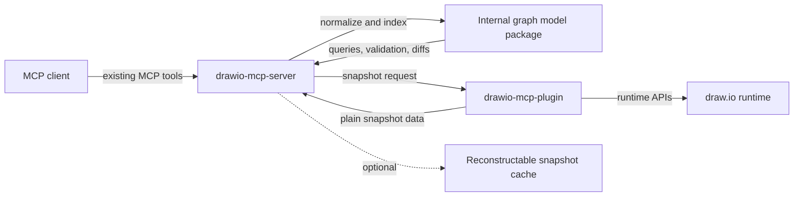
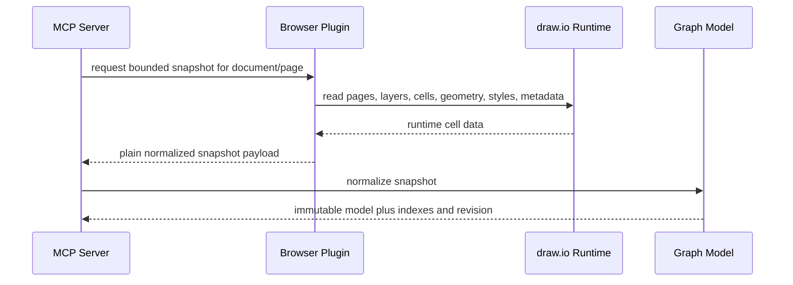
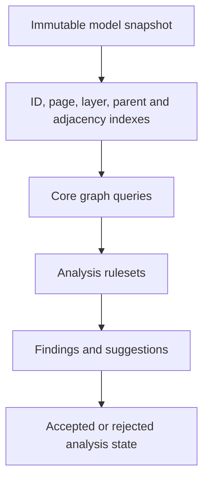
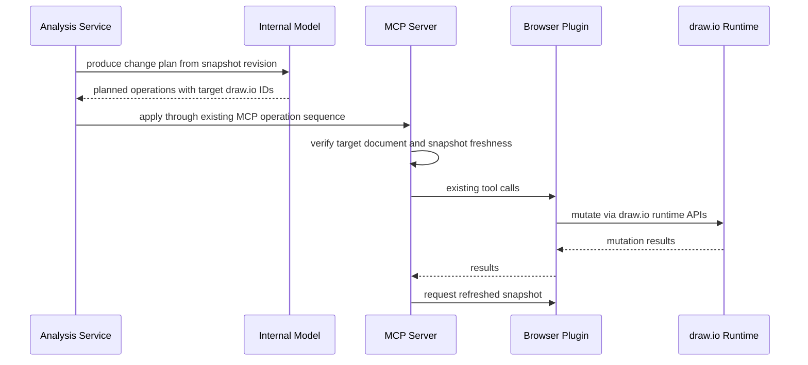
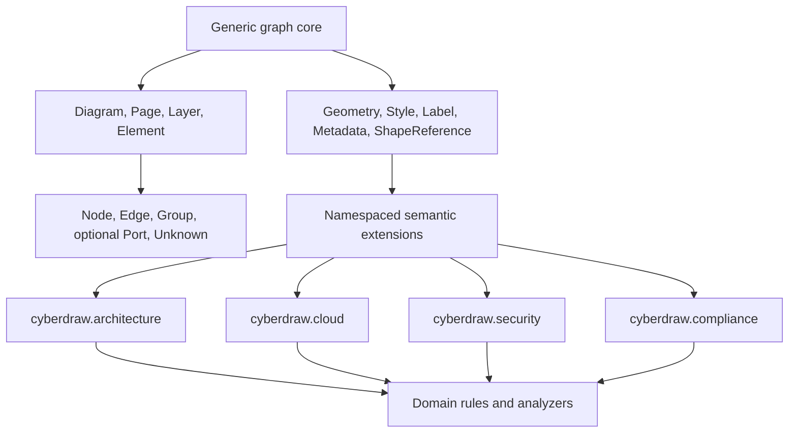

# Internal Graph Model Diagrams

These diagrams support RFC 0001. They describe a proposed architecture, not
accepted implementation behavior.

## Architecture Placement

## Snapshot Flow

## Analysis Flow

## Applying Changes

## Core and Extensions

