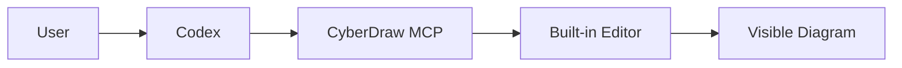

# M21 - Final MVP Product Acceptance And Closure

## Status

COMPLETE / CLOSED.

## Verdict

PASS WITH LIMITATIONS.

M21 validates the CyberDraw MVP from the M20 distributable artifact, not from
workspace source execution. The accepted MVP is the local-first stdio profile:

```text
MCP client -> stdio -> drawio-mcp-server --editor
                         |
                         v
                 loopback HTTP editor
                         |
                         v
                 loopback WebSocket bridge
                         |
                         v
                 visible draw.io diagram
```

The final product acceptance result is:

| Decision                   | Verdict                | Basis                                                                                                         |
| -------------------------- | ---------------------- | ------------------------------------------------------------------------------------------------------------- |
| Product acceptance         | PASS WITH LIMITATIONS  | Clean tarball install, cold/warm editor startup, MCP handshake, public create flow and read-only checks pass. |
| Internal MVP               | ACCEPTED               | The official local loopback stdio flow is usable from the packaged artifact.                                  |
| External distributable MVP | READY WITH LIMITATIONS | The server artifact is installable and accepted, but license/provenance limitations remain visible.           |
| Public beta                | NOT READY              | Public beta still needs final legal/release review, broader client acceptance and support policy hardening.   |

M21 does not publish npm, create a tag, create a GitHub Release or declare a
public beta.

## Scope

M21 covers:

- artifact generation and verification from main commit
  `3cc8028533da2d034e7fcd9365f3ff1e04c4bbdb`;
- clean installation of `drawio-mcp-server-2.2.0.tgz`;
- cold-cache built-in editor startup using pinned draw.io assets;
- warm-cache restart;
- stdio MCP handshake through the installed server binary;
- public tool discovery;
- visible diagram creation through `cyberdraw_create_diagram`;
- public read-only inspection through inherited read-only tools and
  `cyberdraw_analyze_structure`;
- controlled negative cases;
- upgrade dry-run using the same pinned tarball;
- uninstall/cleanup of temporary acceptance state;
- final MVP readiness decision and residual limitations.

M21 does not add product functionality, public tools, public schemas, public
semantic diff, persistence, global identity, mutation execution, approval,
rollback, transactions, remote deployment, auth, provider integration,
watchers, streaming or chunking.

## Artifact Under Acceptance

| Field        | Value                                                                                                                              |
| ------------ | ---------------------------------------------------------------------------------------------------------------------------------- |
| Package      | `drawio-mcp-server`                                                                                                                |
| Version      | `2.2.0` current acceptance candidate, not a published final release declaration                                                    |
| File         | `drawio-mcp-server-2.2.0.tgz`                                                                                                      |
| Entries      | 73                                                                                                                                 |
| Size         | 153375 bytes                                                                                                                       |
| SHA-256      | `57ba4e26955206079f44279ca0b552b9a32a76e794eb0dba78a8e00191793013`                                                                 |
| SHA-512      | `8b2676aa9380d220e202b0ee2e411e0a264481ef45feb03624a2bd3360aa0ffa7a1314edc652b38ac5e01117821cd8f91a5a33dd97c2417557c81d241723fe04` |
| Binary       | `drawio-mcp-server`                                                                                                                |
| Node used    | `v24.18.0`                                                                                                                         |
| pnpm used    | `10.8.1`                                                                                                                           |
| esbuild used | `0.25.12`                                                                                                                          |

The distributed package metadata contains no `workspace:*` ranges and no
runtime dependency on private `cyberdraw-*` packages.

## Draw.io Asset Acceptance

M21 cold-cache startup used the pinned M20 asset:

| Field   | Value                                                                                                                              |
| ------- | ---------------------------------------------------------------------------------------------------------------------------------- |
| Version | `v31.1.5`                                                                                                                          |
| URL     | `https://github.com/jgraph/drawio/releases/download/v31.1.5/draw.war`                                                              |
| SHA-256 | `43b0437762cf25375e233726d6539792584c4bd38176e4eceae5ea4359090278`                                                                 |
| SHA-512 | `56ea7da0efd96f70aca9d0190a87adc5290660c0941291f704bb94c407f7a07f380251a61dcbed77fff25661cd990668724acd7cd21ed0b1a3c16338e3018b38` |

Observed cold-cache log sequence:

1. assets not found under the temporary asset path;
2. download from the pinned draw.io URL;
3. download complete;
4. checksum verification;
5. checksum verified;
6. extraction;
7. extraction complete;
8. `WEB-INF` and `META-INF` cleanup;
9. assets ready;
10. editor and WebSocket ready on `127.0.0.1`.

Warm-cache restart did not redownload the WAR.

## Acceptance Evidence

Detailed acceptance evidence:

- [`m21/acceptance-evidence.md`](m21/acceptance-evidence.md)
- [`m21/final-readiness-decision.md`](m21/final-readiness-decision.md)
- [`m21/residual-limitations.md`](m21/residual-limitations.md)

Summary:

| Area                | Result | Evidence                                                                                  |
| ------------------- | ------ | ----------------------------------------------------------------------------------------- |
| Artifact generation | PASS   | M20 `pack:artifact` produced the expected tarball and `verify:artifact` passed.           |
| Clean install       | PASS   | Temporary `HOME`, `PNPM_HOME`, store and app install succeeded outside the monorepo.      |
| Runtime closure     | PASS   | Installed package had no unresolved `workspace:*` or private first-party runtime imports. |
| CLI help            | PASS   | `drawio-mcp-server --help` ran from the clean install and reported version `2.2.0`.       |
| Cold-cache startup  | PASS   | Pinned draw.io WAR downloaded, verified and extracted before editor readiness.            |
| Loopback binding    | PASS   | HTTP and WebSocket used `127.0.0.1` with temporary ports.                                 |
| MCP handshake       | PASS   | Stdio MCP client connected to the installed binary.                                       |
| Tool discovery      | PASS   | 30 tools listed, including `cyberdraw_create_diagram` and `cyberdraw_analyze_structure`.  |
| Diagram creation    | PASS   | Public `cyberdraw_create_diagram` returned `accepted`.                                    |
| Visual result       | PASS   | Screenshot shows five labelled nodes, four links and left-to-right layout.                |
| Read-only analysis  | PASS   | `cyberdraw_analyze_structure` returned `m13-v1`, read-only safety and zero mutations.     |
| Negative cases      | PASS   | Invalid Mermaid, over-limit input and missing tool returned controlled errors.            |
| Warm-cache restart  | PASS   | Restart reused verified assets and repeated the same semantic create/analyze result.      |
| Cleanup             | PASS   | Temporary upgrade install was removed and no server process remained.                     |

## Functional Acceptance Case

The accepted Mermaid input was:



The public tool response was:

- `version`: `m15-v1`;
- `outcome`: `accepted`;
- page name: `M21 Acceptance Flow`;
- `mutationAttempted`: `true`;
- `mutationInvocations`: `1`.

The visible draw.io canvas showed:

- `User`;
- `Codex`;
- `CyberDraw MCP`;
- `Built-in Editor`;
- `Visible Diagram`;
- four visible left-to-right links;
- no Mermaid, plugin, WebSocket or server crash error.

`list-paged-model` returned seven raw draw.io vertex cells for the page because
draw.io includes structural cells in the model. The browser-rendered graph
state and screenshot confirmed five visible diagram nodes and four visible
edges. M21 therefore records visual node/link evidence separately from raw
draw.io model cell counts.

## Negative Acceptance

| Case             | Result                                                                               |
| ---------------- | ------------------------------------------------------------------------------------ |
| Invalid Mermaid  | `cyberdraw_create_diagram` returned `rejected` with `unsupported-mermaid-type`.      |
| Over-limit input | `cyberdraw_create_diagram` returned `rejected` with `mermaid-too-large`.             |
| Missing tool     | MCP returned controlled `isError: true` with `MCP error -32602: Tool ... not found`. |

An extra unknown field on a otherwise valid `cyberdraw_create_diagram` request
was accepted by the current public tool wrapper. M21 does not change that
contract; it records the missing-tool case as the invalid tool/parameter
negative gate.

## Security And Trust Boundary

The final MVP remains a trusted-client local deployment:

- stdio client launches and owns the server process;
- built-in editor and WebSocket bind to loopback for the official profile;
- no server-side LLM/provider is used;
- no API keys are required;
- public responses remain sanitized and do not expose raw XML, raw runtime
  snapshots, private identity signatures or semantic diff internals;
- the artifact does not introduce persistence, mutation execution beyond the
  explicit `cyberdraw_create_diagram` import, approval, rollback or
  transactions.

## Residual Limitations

M21 accepts the MVP with these visible limitations:

- draw.io WAR bundled third-party notice review remains incomplete;
- icon, font, stencil and template notices inside the WAR remain pending for a
  public beta standard;
- extraction is not claimed atomic;
- project-specific path traversal proof for the WAR extractor is not complete;
- dev/test dependency audit still reports `GHSA-mh99-v99m-4gvg` in
  `brace-expansion` through Jest/Istanbul/glob tooling;
- acceptance ran on Node 24 in this environment; Node 22 remains covered by CI
  lanes and should be replayed for release sign-off if required;
- Codex was represented by an isolated stdio MCP client configuration and MCP
  protocol handshake against the installed artifact; broader interactive Codex
  UX sign-off remains a release/support exercise;
- Claude Desktop, Claude Code, Zed, OpenCode and oterm remain documented but
  not product-accepted clients.

## Final Product Boundary

M21 closes the MVP as:

- local-first;
- stdio MCP;
- packaged `drawio-mcp-server --editor`;
- loopback built-in editor;
- visible draw.io diagram creation from bounded client-generated Mermaid;
- public read-only inspection and structural analysis;
- no global identity;
- no persistence;
- no public semantic diff;
- no Architecture Intelligence mutation executor;
- no approval workflow;
- no rollback or transactions.

Future work after M21 is post-MVP and must use separate milestones.
