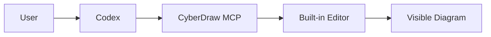

# M21 Acceptance Evidence

## Status

COMPLETE.

## Environment

| Field         | Value                                                  |
| ------------- | ------------------------------------------------------ |
| Source commit | `3cc8028533da2d034e7fcd9365f3ff1e04c4bbdb`             |
| Branch        | `release/m21-final-mvp-product-acceptance-and-closure` |
| Node          | `v24.18.0`                                             |
| pnpm          | `10.8.1`                                               |
| esbuild       | `0.25.12`                                              |
| Package       | `drawio-mcp-server`                                    |
| Version       | `2.2.0`                                                |

The acceptance harness used temporary directories for `HOME`, `PNPM_HOME`,
pnpm store, app install, config, asset cache and logs. The runtime server
command was the installed package binary:

```text
<tmp>/app/node_modules/.bin/drawio-mcp-server
```

The browser and MCP client harness were external test observers. The server
runtime did not execute `packages/drawio-mcp-server/build/index.js` from the
source checkout.

## Artifact

Generated with:

```sh
corepack pnpm@10.8.1 --filter drawio-mcp-server run pack:artifact -- --out <tmp>
corepack pnpm@10.8.1 --filter drawio-mcp-server run verify:artifact -- <tmp>/drawio-mcp-server-2.2.0.tgz
```

Observed artifact:

| Field   | Value                                                                                                                              |
| ------- | ---------------------------------------------------------------------------------------------------------------------------------- |
| File    | `drawio-mcp-server-2.2.0.tgz`                                                                                                      |
| Entries | 73                                                                                                                                 |
| Size    | 153375 bytes                                                                                                                       |
| SHA-256 | `57ba4e26955206079f44279ca0b552b9a32a76e794eb0dba78a8e00191793013`                                                                 |
| SHA-512 | `8b2676aa9380d220e202b0ee2e411e0a264481ef45feb03624a2bd3360aa0ffa7a1314edc652b38ac5e01117821cd8f91a5a33dd97c2417557c81d241723fe04` |

The package verification script returned:

```json
{
  "ok": true,
  "entryCount": 73,
  "packageName": "drawio-mcp-server",
  "packageVersion": "2.2.0"
}
```

## Clean Installation

Installed from the tarball with:

```sh
HOME=<tmp>/home \
PNPM_HOME=<tmp>/pnpm-home \
XDG_CONFIG_HOME=<tmp>/config \
corepack pnpm@10.8.1 \
  --store-dir <tmp>/store \
  --dir <tmp>/app \
  add <tmp>/drawio-mcp-server-2.2.0.tgz
```

Result:

- install passed;
- `drawio-mcp-server 2.2.0` installed;
- package binary was executable;
- `LICENSE.md` present;
- `THIRD_PARTY_NOTICES.md` present;
- plugin present at `build/plugin/mcp-plugin.js`;
- vendored first-party runtime present under `build/vendored/`;
- no unresolved `workspace:*`, `cyberdraw-graph-model` or
  `cyberdraw-runtime-contract` runtime imports were found in distributed
  JavaScript.

`drawio-mcp-server --help` ran from the clean install and reported version
`2.2.0`.

## Cold Cache Startup

The first startup used an empty asset path and temporary loopback ports:

```text
drawio-mcp-server --editor
  --host 127.0.0.1
  --http-port <temp>
  --extension-port <temp>
  --asset-path <tmp>/assets
  --logger console
```

Observed values:

| Field              | Value                 |
| ------------------ | --------------------- |
| HTTP port          | `35953`               |
| WebSocket port     | `35541`               |
| Startup duration   | approximately `75.9s` |
| External bind seen | `false`               |

The stderr log showed:

- `Downloading draw.io v31.1.5 draw.war`;
- pinned GitHub release URL;
- `Download complete`;
- `Verifying draw.io asset checksum`;
- `Checksum verified`;
- `Extracting archive`;
- `Extraction complete`;
- `Assets ready`;
- HTTP editor active on `http://127.0.0.1:35953/`;
- WebSocket active on the temporary loopback port;
- plugin document-state control messages received.

The acceptance script did not observe a crash.

## MCP Configuration

The temporary MCP configuration used stdio and the installed binary:

```json
{
  "type": "stdio",
  "command": "<tmp>/app/node_modules/.bin/drawio-mcp-server",
  "args": [
    "--editor",
    "--host",
    "127.0.0.1",
    "--http-port",
    "<temp-http-port>",
    "--extension-port",
    "<temp-ws-port>",
    "--asset-path",
    "<tmp>/assets",
    "--logger",
    "console"
  ]
}
```

No persistent user MCP configuration was used.

## Tool Discovery

Tool discovery returned 30 tools.

Required public tools were present:

- `cyberdraw_create_diagram`;
- `cyberdraw_analyze_structure`.

## Functional Case A - Visible Creation

Input:



Public tool result:

```json
{
  "version": "m15-v1",
  "outcome": "accepted",
  "created": {
    "pageName": "M21 Acceptance Flow"
  },
  "safety": {
    "mutatesDiagram": true,
    "mutationAttempted": true,
    "mutationInvocations": 1
  }
}
```

Visual evidence from the browser:

- five visible nodes;
- four visible links;
- left-to-right layout;
- labels visible: `User`, `Codex`, `CyberDraw MCP`, `Built-in Editor`,
  `Visible Diagram`;
- no visible Mermaid error;
- no browser error dialogs observed;
- screenshot captured locally in the temporary evidence directory and not added
  to the repository.

The raw draw.io page model returned seven vertex cells through
`list-paged-model` because it includes structural/root cells in addition to the
five rendered nodes. The visual graph state and screenshot are the accepted
node/link evidence.

## Public Read-Only Inspection

`list-paged-model` over the created page returned:

- raw vertex cell count: 7;
- raw edge cell count: 4.

`cyberdraw_analyze_structure` over the created page returned:

- `version`: `m13-v1`;
- `mode`: `analyze`;
- requested page scope: the created page ID;
- `expanded`: `false`;
- `documentScopeUsed`: `false`;
- `safety.readOnly`: `true`;
- `mutationAttempted`: `false`;
- `mutationInvocations`: `0`;
- findings: `0`;
- broken references: `0`;
- cross-layer edges: `0`;
- proposals/conflicts/manual review: `0`.

## Determinism / Repeatability

Warm-cache restart repeated the same semantic input:

- create outcome stayed `accepted`;
- raw vertex count stayed 7;
- raw edge count stayed 4;
- visual node count stayed 5;
- visual edge count stayed 4;
- analysis version and mode stayed `m13-v1` / `analyze`;
- no global identity or persistent ID equality was asserted.

## Negative Acceptance

| Case             | Result                                                                                   |
| ---------------- | ---------------------------------------------------------------------------------------- |
| Invalid Mermaid  | `outcome: rejected`, `reasonCodes: ["unsupported-mermaid-type"]`, no mutation attempted. |
| Over-limit input | `outcome: rejected`, `reasonCodes: ["mermaid-too-large"]`, no mutation attempted.        |
| Missing tool     | MCP `isError: true`, `MCP error -32602: Tool cyberdraw_m21_missing_tool not found`.      |

## Restart / Warm Cache

Warm-cache restart used the same asset path:

| Field            | Value                 |
| ---------------- | --------------------- |
| HTTP port        | `42821`               |
| WebSocket port   | `45545`               |
| Startup duration | approximately `11.4s` |
| WAR redownload   | `false`               |

The server reported `Assets ready`, served the editor on loopback and allowed a
second `cyberdraw_create_diagram` run.

## Upgrade And Cleanup

Upgrade dry-run installed the same `drawio-mcp-server-2.2.0.tgz` in a second
temporary app and confirmed:

- package name: `drawio-mcp-server`;
- package version: `2.2.0`;
- binary: `drawio-mcp-server -> build/index.js`;
- temporary upgrade directory removed after the check.

Cleanup evidence:

- MCP client closed;
- browser contexts closed;
- server stdio session closed;
- server logs showed shutdown via stdin end and close completion;
- temporary upgrade app/store/config removed;
- no source checkout was used as runtime server.

## Evidence Classification

| Case                         | Level            |
| ---------------------------- | ---------------- |
| Artifact generation          | REAL-PROVEN      |
| Clean tarball install        | REAL-PROVEN      |
| Cold-cache asset download    | REAL-PROVEN      |
| SHA verification before use  | REAL-PROVEN      |
| Loopback editor startup      | REAL-PROVEN      |
| MCP handshake/tool discovery | REAL-PROVEN      |
| Visible diagram creation     | REAL-PROVEN      |
| Public read-only inspection  | REAL-PROVEN      |
| Negative input handling      | REAL-PROVEN      |
| Warm-cache restart           | REAL-PROVEN      |
| Upgrade dry-run              | REAL-PROVEN      |
| Interactive Codex UX         | PARTIALLY-PROVEN |
| Node 22 clean acceptance     | PARTIALLY-PROVEN |
| Other MCP clients            | UNPROVEN         |
